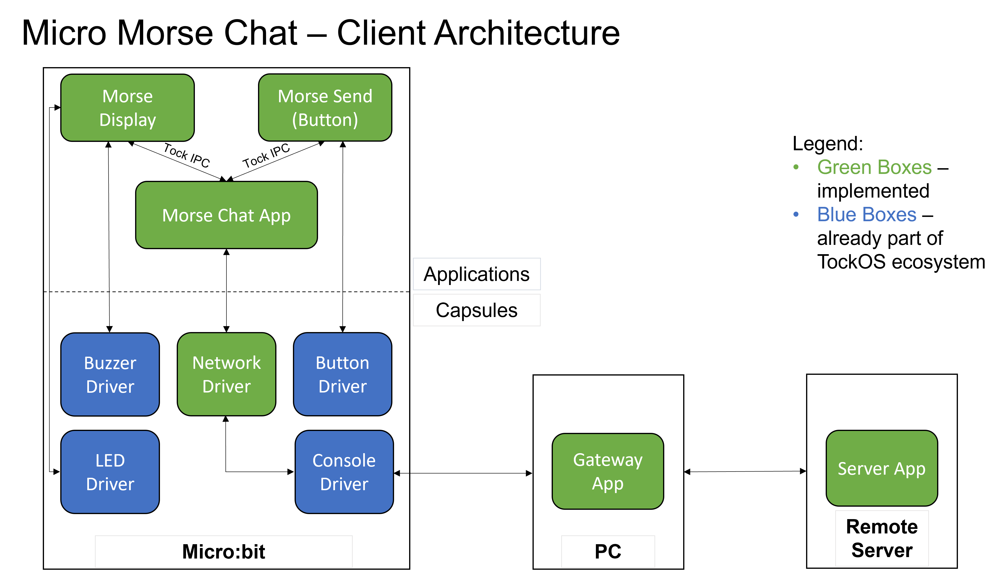
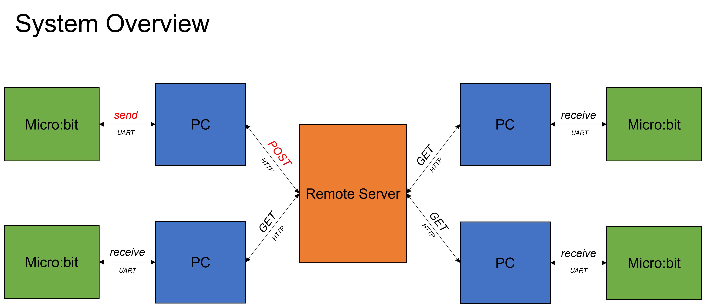

# Micro Morse Chat
Authors: Andrei Cherechesu, Dragos Cocirlea, Catalin Vajaiala
## Project Description
Micro Morse Chat is a multi-client application that allows multiple Micro:bit platforms running TockOS to communicate with each other using Morse code. A user can use the two microcontroller buttons to represent a '.' symbol (dot) and '-' (dash) symbols respectively.

The Micro Morse Chat application supports both GET and POST operations, to retrieve and send data to a remote web server.

The Morse Code characters are sent from the 'Morse Button' application, which listens on the button presses, to the main 'Morse Chat App' via the Tock IPC library. Next, the 'Morse Chat App' sends the characters, using a 'Network Driver' capsule (which uses a Console Driver), over a serial connection (UART) to a PC, which runs a proxy 'Gateway App'.  The ‘Gateway App’ retrieves messages sent by Micro:bit and forwards them, packed as HTTP Requests, to a remote web server.

The server stores the messages (each containing the ID of the Morse Chat client that sent it) until they are requested by the client applications. These requests are made periodically, asynchronously, by Micro:bit clients, from the Micro Morse Chat application.

Once a message reaches the client, the Morse Chat App "decodes" the message, using the buzzer to audibly transmit the received message, and the LED Matrix to display the received message (letter by letter) or the digit corresponding to the sender ID of the message, using the Morse Display App. Communication between the two applications is also done using Tock IPC.

Each Micro:bit client can be both sender and receiver, the client applications running on them being identical.

## Client Architecture


## System Overview


## Getting Started

Make sure you have set up all the tools required to 
build [Tock](https://github.com/tock/tock) and [libtock-c applications](https://github.com/tock/libtock-c).

Both projects provide really good getting started tutorials ([Tock](https://github.com/tock/tock/blob/master/doc/Getting_Started.md), 
[libtock-c](https://github.com/tock/libtock-c/blob/master/README.md))

To set up the workspace, run:

```bash
git submodule update --init
```

Then, compile and load the TockOS kernel:
```bash
cd <repo_dir>/kernel/microbit_v2
make program
```

Then, compile and load the apps:
```bash
cd <repo_dir>/applications/morse_chat
make && tockloader install

cd <repo_dir>/applications/morse_button
make && tockloader install

cd <repo_dir>/applications/morse_display
make && tockloader install
```

Then, open another terminal and start the Gateway application to listen:
```bash
cd <repo_dir>/Morse-Chat-Gateway
yarn install
yarn start
```

Note: In order for the system to run correctly, the Morse Chat Server needs to be either:
 - ran locally (in which case the URLs the board sends requests to needs to be http://localhost:8000)
 - hosted on a public cloud infrastructure (and the URL needs to be http://your_VM_public_ip:8000)

A Docker Compose file is provided in the Morse-Chat-Server submodule to ease the build and
launch steps for the web server.

## Drivers

 - Capsule Networking Driver ([source](kernel/drivers/src/network.rs))
 - User-Space Networking Driver ([source](applications/drivers/network.c))

## Applications

 - Morse Chat App ([source](applications/morse_chat/morse_chat.c))
 - Morse Button App ([source](applications/morse_button/morse_button.c))
 - Morse Display App ([source](applications/morse_display/morse_display.c))

## External Applications
 - Morse Chat Gateway ([submodule](https://github.com/AndreiCherechesu/Morse-Chat-Gateway))
 - Morse Chat Server ([submodule](https://github.com/AndreiCherechesu/Morse-Chat-Server) - written in Rust)

